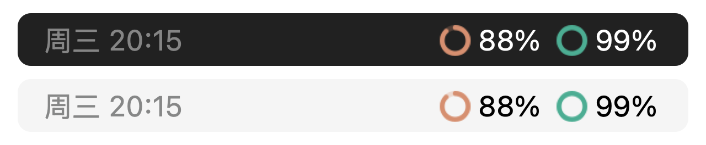
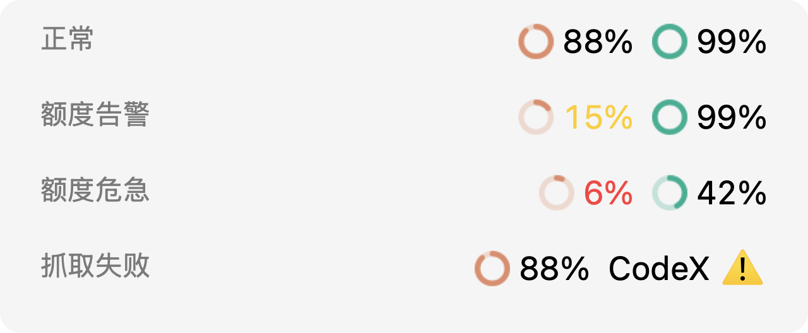
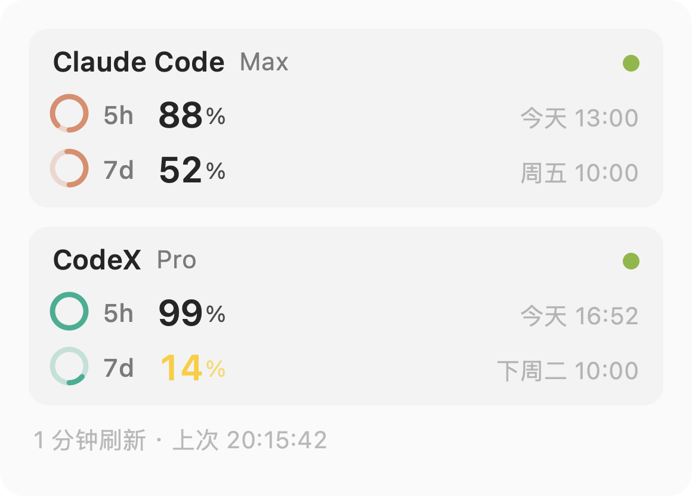
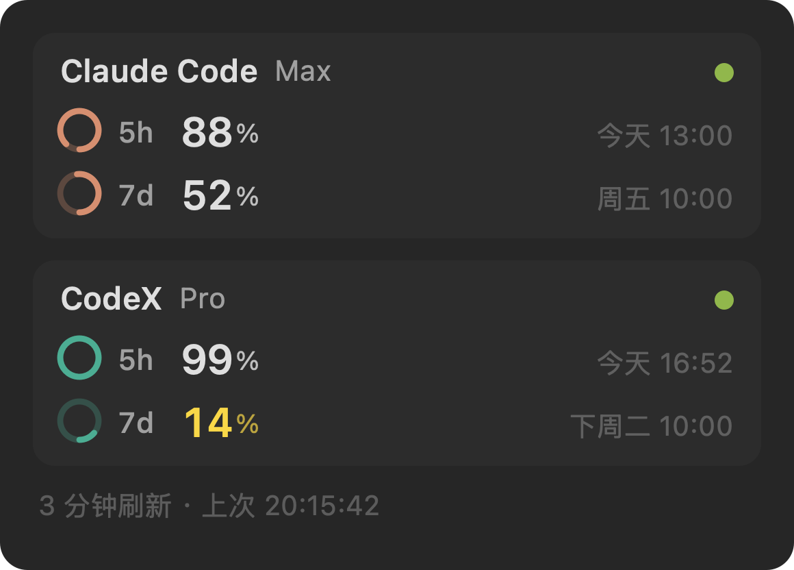
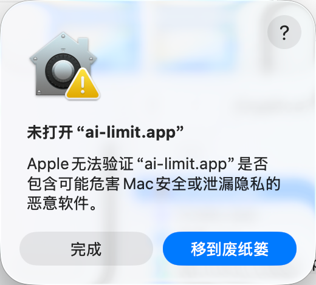
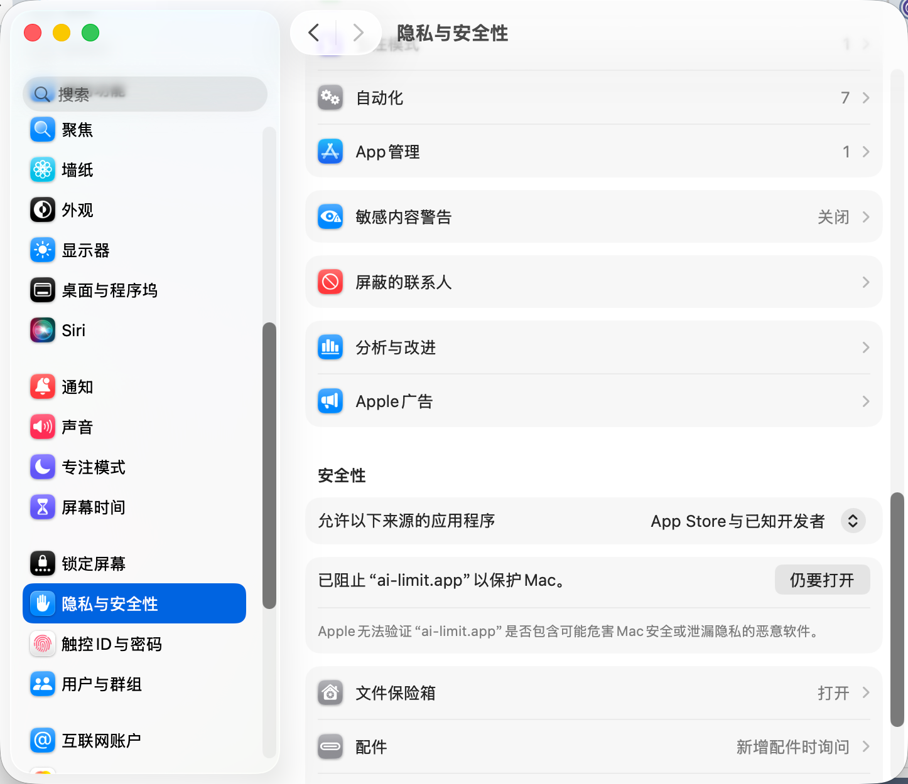
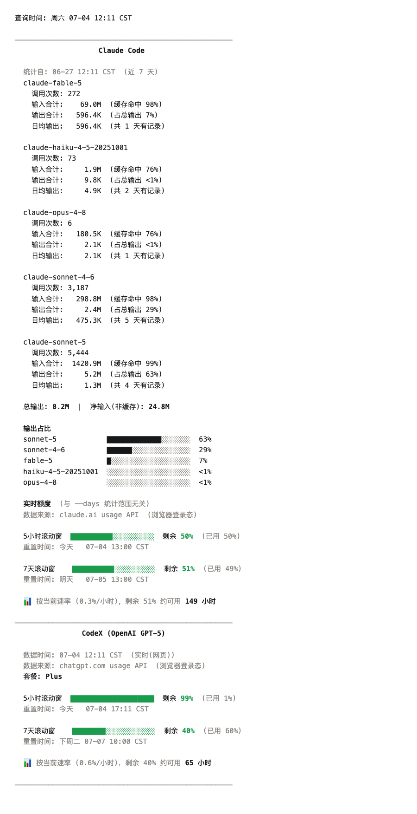

# ai-limit（改造版）

macOS 菜单栏实时监控 **Claude Code** 和 **CodeX** 的剩余额度。

本仓库是 [zhuchenxi113/ai-limit](https://github.com/zhuchenxi113/ai-limit) 的 fork，在上游 v0.3.23 基础上重造了整套菜单栏 UI，并加固了可靠性、大幅降低了请求量。按自己的使用需求持续迭代，不跟随上游自动更新，也不保证及时处理 issue / PR。

## 菜单栏

环形进度 + 百分比，颜色即服务：**橙环 = Claude**，**青绿环 = CodeX**。相比上游的文字 + 电池样式，宽度从 189px 压到 99px，不再需要 Bartender 收纳。



告警不靠环变色（环的颜色被品牌占用），靠**数字变色**：剩余低于 20% 黄、低于 10% 红。环管「是哪个服务」，数字管「慌不慌」，两个信号互不干扰。某个服务抓取失败时退回带服务名的 ⚠️——报错必须说清是谁挂了。



## 详情面板

左键点击弹出卡片式面板：环形进度 + 大号百分比 + 重置时间 + 服务健康状态点（数据来自官方 status page）。设置项都在面板下方的菜单里。

<table><tr>
  <td></td>
  <td></td>
</tr></table>

## 可靠性（fork 版新增）

- **抖动抑制**：claude.ai / chatgpt.com 会对非浏览器请求做随机人机校验（TLS 指纹），单次抓取失败是常态。fork 版失败时沿用上一份好数据，**连续失败 3 次（或数据老于 15 分钟）才显示 ⚠️**，冷启动和未登录照样立刻报错。实测回放：CodeX 误报从 25 分钟降到 1 分钟。吸收期间面板 footer 显示「重试中」。
- **请求风暴防护**：初始化 timer 的 stop 提前到函数首行，任何初始化异常都不会再演变成每秒 3 次的请求风暴（上游版本存在此隐患，会触发 Cloudflare 持续拦截）。
- **低调采集（降低风控画像信号）**：
  - **CodeX access token 进程内缓存**：不再每轮刷新都调 `/api/auth/session` 换 token（鉴权端点在风控中权重高），按 JWT exp 缓存、401 时强刷重试一次，鉴权请求从 ~1440 次/天降到个位数。
  - **Claude 套餐名缓存 12 小时**：套餐几个月才变一次，不再每轮跟着 usage 查一次 `organizations/{org}`，Claude 侧请求量减半。
  - **默认刷新 3 分钟 + 0–20s 随机抖动**：5h/7d 额度窗口以小时计，1 分钟粒度无信息增量；抖动打破「精确 60.0s 节拍」这一典型自动化特征。手动「立即刷新」不受影响。
  - **连败指数退避**：连续失败 3 次后按 2 倍递增间隔跳过刷新（上限 30 分钟），不再在被 Cloudflare 拦截期间按原频率硬撞；抓取成功或手动刷新即恢复。
- **「检查更新」已禁用**：上游的更新通道会用官方 DMG 覆盖本地改造版。跟进上游改用 `git fetch upstream` 手动合并。

## 安装

从 [Releases](https://github.com/dtzeng811/ai-limit/releases/latest) 下载最新 DMG，双击挂载后把 **AI Limit.app** 拖进 Applications。

App 未签名公证，首次打开按系统版本二选一：

- **macOS 15 Sequoia 及以后**：双击后弹窗只有「完成 / 移到废纸篓」，点「完成」，再到 **系统设置 → 隐私与安全性** 下滚到「安全性」，点 **「仍要打开」**，密码 / 触控 ID 确认。
- **macOS 14 Sonoma 及更早**：右键（Control 点按）App → **打开** → 对话框里再点 **打开**。

仅支持 Apple 芯片（arm64）的 Mac。

<table><tr>
  <td></td>
  <td></td>
</tr></table>

## 从源码构建

```bash
git clone https://github.com/dtzeng811/ai-limit.git && cd ai-limit
python3 -m venv .venv
.venv/bin/pip install -r requirements.txt pyobjc py2app
cd menubar
../.venv/bin/python setup.py py2app   # 产出 dist/AI Limit.app
bash make-dmg.sh                      # 产出 dist/ai-limit-<version>.dmg
```

> 必须用 Homebrew / python.org 的 Python（实测 3.14 可用），不能用 Anaconda（dylib 路径冲突导致 App 无法运行）。

开发调试不用打包，直接跑：

```bash
cd menubar && ../.venv/bin/python ai-limit-app.py
```

## 命令行

CLI 与上游一致，未改动。输出语言跟随系统 locale，可用 `AI_LIMIT_LANG=zh|en` 强制指定。

```bash
alias ai-limit="python3 ~/Developer/Codex/Demo/ai-limit/usage.py"
ai-limit              # 最近 7 天（默认）
ai-limit --days 1     # 今天
ai-limit --detail     # 每个模型的详细 token 统计
```



## 数据来源

### Claude Code

| 数据 | 来源 |
|------|------|
| token 消耗明细 | `~/.claude/projects/**/*.jsonl` |
| 实时剩余额度 | 浏览器 Cookie → `claude.ai/api/organizations/{orgId}/usage` |

### CodeX

按优先级依次尝试：

| 优先级 | 来源 | 是否触发 5h 窗口 |
|------|------|------|
| 1 | 浏览器 Cookie → `chatgpt.com/backend-api/codex/usage` | ❌ |
| 2 | `codex app-server` WebSocket | ⚠️ **会触发** |
| 3 | 本地 `~/.codex/sessions/**/*.jsonl` | ❌ |

> **副作用警告**：路径 1 失败时自动 fallback 到路径 2，OpenAI 会将其计为一次会话开始——若当前 5 小时窗口已到期，会触发新的冷却窗口计时。这是 CodeX 接口的固有机制。

### 说明

- 浏览器 Cookie 读取仅支持 macOS（依赖 Keychain 解密），需要 Chrome/Firefox 已登录 claude.ai 和 chatgpt.com
- 偶发 ⚠️ 多为 Cloudflare 临时拦截，fork 版的抖动抑制会吸收大部分；若 ⚠️ 持续不消，打开 [Claude 用量页](https://claude.ai/settings/usage) 并保持标签页不关
- Claude 额度用的是 claude.ai 内部接口，非官方 API，可能随版本失效
- `<synthetic>` 模型记录是 Claude Code 遇到 API 错误时写入的占位，不计入统计

## 架构备忘（改这个项目前先读）

- `usage.py` = 数据层（抓取 + CLI 渲染）；`menubar/ai-limit-app.py` = 菜单栏 App；`menubar/panelui.py` = 面板绘制层（纯画图，不碰数据和 i18n，可离屏单测）
- **rumps 的事件循环与 NSPopover 不兼容**（`isShown` 恒为 False；裸 AppKit 可弹、rumps 内不可弹）。面板走的是 `NSMenuItem.setView_` 内嵌视图，别再试 popover 路线
- 菜单栏环形图不能 `setTemplate_(True)`——template 图在 NSStatusBarButton 的文本附件里不渲染，且会抹掉品牌色
- 一次性 timer 的 `sender.stop()` 必须放函数首行（见 `_init_render` 注释），否则任何初始化异常都会变成请求风暴

## License

[Apache License 2.0](LICENSE)，沿用上游。原项目版权归 [zhuchenxi](https://github.com/zhuchenxi113) 所有；本 fork 的改动同样以 Apache 2.0 发布。

第三方依赖：`browser-cookie3` 使用 LGPL 协议。
