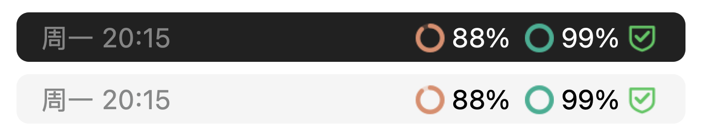
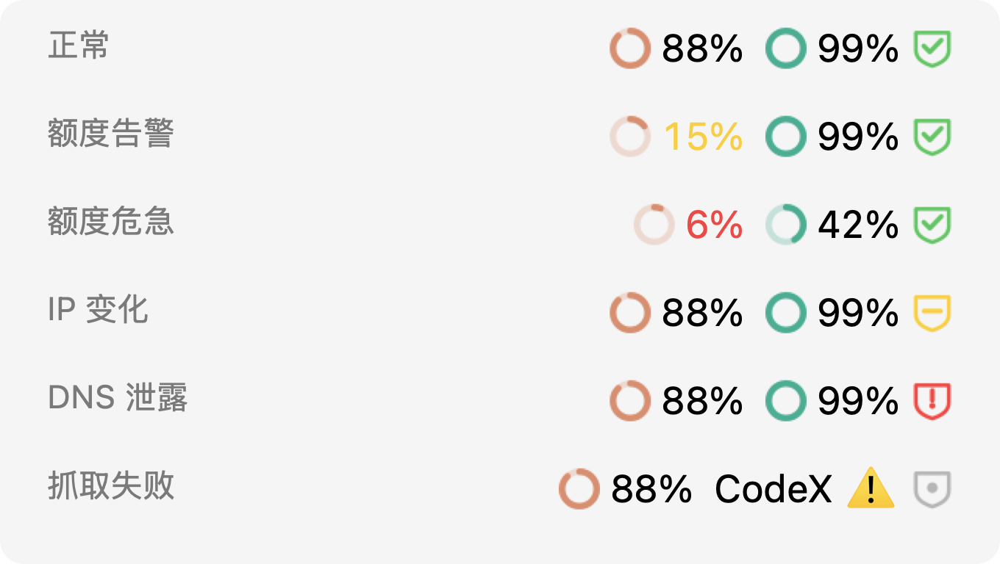
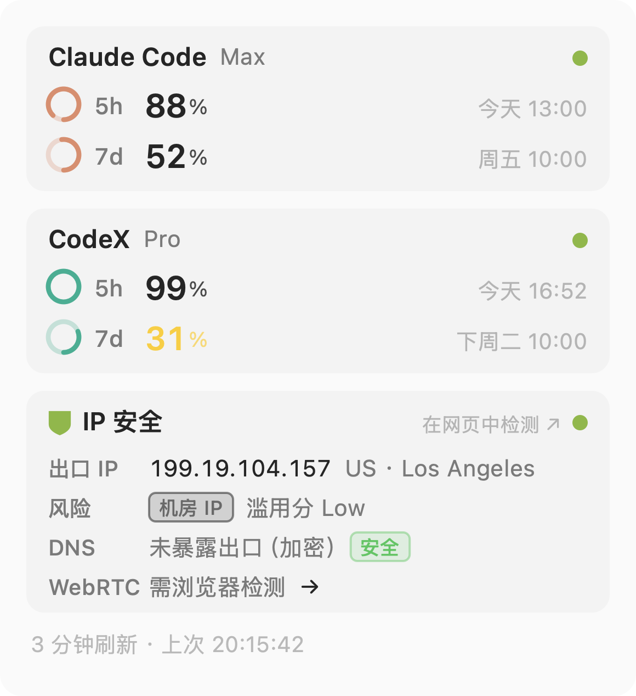
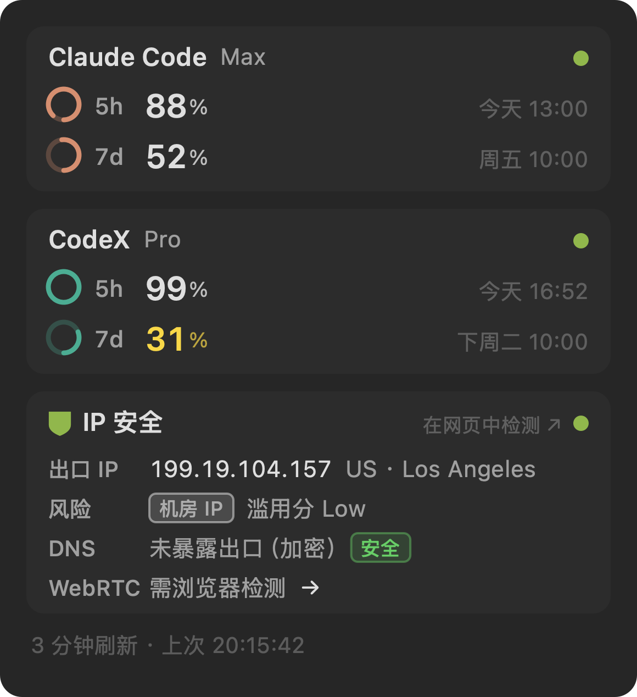
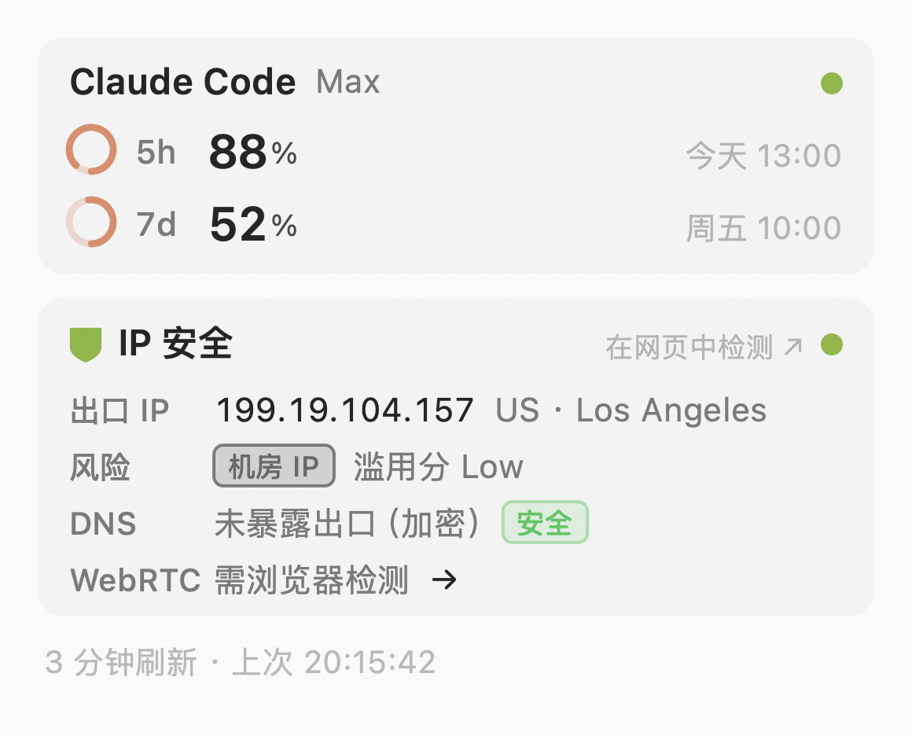
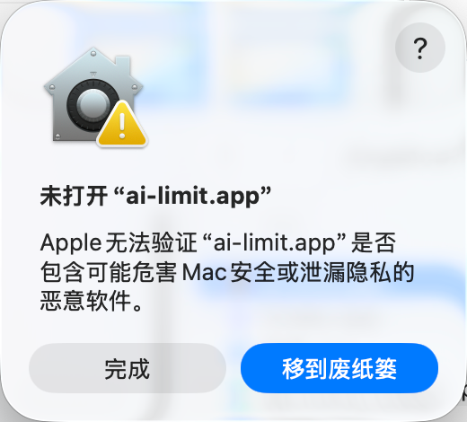
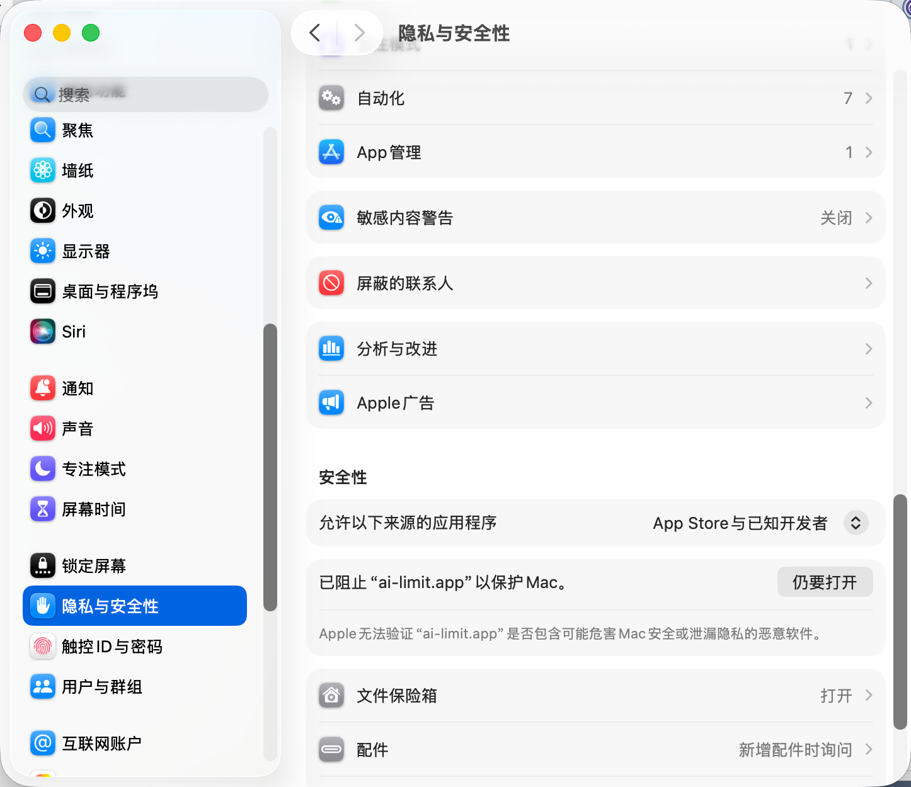
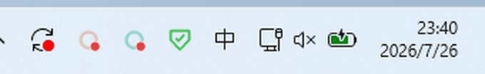
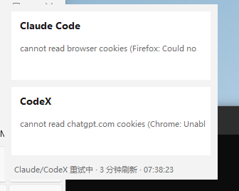
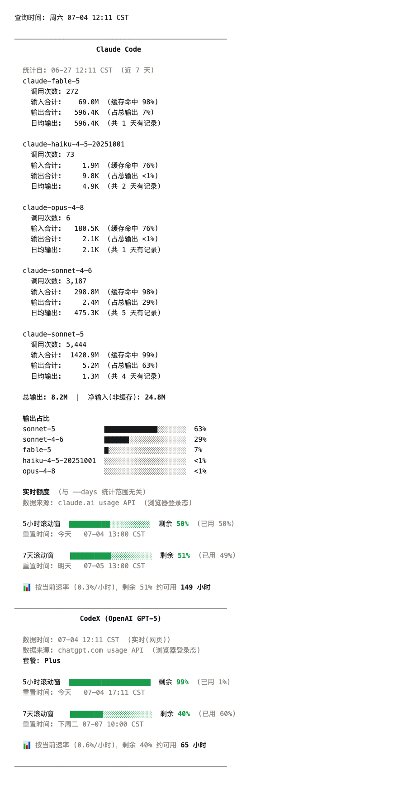

# ai-limit（改造版）

实时监控 **Claude Code** 和 **CodeX** 的剩余额度。macOS 菜单栏 + Windows 系统托盘 + Linux 托盘（AppIndicator）。

本仓库是 [zhuchenxi113/ai-limit](https://github.com/zhuchenxi113/ai-limit) 的 fork，在上游 v0.3.23 基础上重造了整套菜单栏 UI，并加固了可靠性、大幅降低了请求量。按自己的使用需求持续迭代，不跟随上游自动更新，也不保证及时处理 issue / PR。

## 菜单栏

环形进度 + 百分比，颜色即服务：**橙环 = Claude**，**青绿环 = CodeX**。相比上游的文字 + 电池样式，宽度从 189px 压到 99px，不再需要 Bartender 收纳。



告警不靠环变色（环的颜色被品牌占用），靠**数字变色**：剩余低于 20% 黄、低于 10% 红。环管「是哪个服务」，数字管「慌不慌」，两个信号互不干扰。某个服务抓取失败时退回带服务名的 ⚠️——报错必须说清是谁挂了。



## 详情面板

左键点击弹出卡片式面板：环形进度 + 大号百分比 + 重置时间 + 服务健康状态点（数据来自官方 status page）。设置项都在面板下方的菜单里。

Claude 卡片在 5h / 7d 之外还有第三行：**按模型限定的周期额度**（上图的 Fable 行）——这一档在 claude.ai 用量页看得到，但一般的菜单栏工具不显示。标签用服务端下发的模型名，旗舰换代时自动跟随，无需升级 App。macOS 面板与 Windows flyout 均已支持（Windows 上同时进入托盘悬浮 tooltip）。

## CodeX 重置预测（fork 版新增）

近期 CodeX 官方会不定期做全量额度重置（负责人 tibo 常在 X 上预告/官宣）。CodeX 卡片因此多了一行**重置预测**：未来 24h / 48h 内发生重置的概率 + 概率档标签，**整行点击跳转最近一条官宣推文**。

- 数据来自社区「Tibo 雷达」[codex-reset.com](https://codex-reset.com/tibo) 的公开接口（其每 2 分钟同步 @thsottiaux 的 X，28+ 次已验证重置打底）；App 端 **30 分钟拉取一轮** + 随机抖动，与其余采集同一套低调哲学
- 概率档：≥60% 绿「高概率」 / ≥30% 黄「中概率」 / 其余灰「低概率」
- 这是**概率预测不是官方承诺**——数据源自标为实验模型；拿不到数据或缓存超 12 小时，整行自动隐藏，不显示陈旧概率
- 目前 macOS 面板支持，Windows flyout 下个版本跟进

<table><tr>
  <td></td>
  <td></td>
</tr></table>

## IP 安全度（fork 版新增）

菜单栏 / 托盘常驻一个盾牌，反映当前网络环境对 Claude 是否安全。**点击跳转 [ip.net.coffee/claude](https://ip.net.coffee/claude/)** 做完整检测（含 WebRTC）。


四种状态**形状不同**，不只是换色——托盘图标只有 16px，颜色在浅色任务栏上区分度有限，还要照顾色觉障碍：

| 盾牌 | 含义 | 触发条件 |
|---|---|---|
| 🟢 勾 | 正常 | claude.ai 可达、DNS 未泄露、IP 无异常标记 |
| 🟡 横线 | 需注意 | 出口 IP 相比上次发生变化（换节点） |
| 🔴 感叹号 | 有问题 | claude.ai 不可达 / DNS 出口国家 ≠ 出口 IP 国家 / IP 被标记为滥用源 |
| ⚪ 圆点 | 没测到 | 检测中，或连续 3 次失败——**不是红**，「没测到」与「测到问题」必须分开 |

面板里的 IP 安全卡片给出细节，整张卡片可点击跳转：



**数据来源**：复刻该站点自身调用的接口，与网页显示同源——`claude.ai/cdn-cgi/trace` 拿 Claude 视角的出口 IP 与可用性，`ip.net.coffee/api/iprisk/` 拿风险判定（网页那个信任评分的原始数据），DNS 泄露走该站的 token 机制（向 `<token>-N.d.ip.net.coffee` 触发解析，再查谁来解析的）。检测 10 分钟一轮，**不调用该站的 `/api/session`**（那是用于共享分析的 IP 上报，与检测无关）。

**机房 IP 不点亮盾牌**，只在卡片里以标签注明——长期走机房出口的人会导致盾牌常年黄灯，告警就失去意义了。

**WebRTC 不做后台检测**：它必须由浏览器建立 `RTCPeerConnection` 收集 ICE candidate 才测得出，任何后台程序都做不到。卡片如实标注「需浏览器检测 →」并作为跳转钩子，不伪装成已检测。

## 桌面小屏供数（fork 版新增）

把额度快照通过局域网喂给桌面小屏（ES3C28P）。Mac 端起一个只读 HTTP 服务，板子靠 Bonjour（`_ailimit._tcp`）自动发现 IP 和端口，不用写死地址。

所有文案与格式都在 Mac 端算好，板子只负责画——这样显示内容随 ai-limit 迭代而不必重烧固件。

**安全边界（务必了解）**：

1. 服务绑在 `0.0.0.0`，因为板子要靠 mDNS 发现它，绑回环就找不到。
2. **只受理私网 / 回环 / 链路本地来源**，公网可路由的来源在连接层直接拒绝。
3. **没有鉴权**——信任边界是「同一局域网」。返回的是额度百分比和套餐档位（如 Max / Pro），不含任何凭据。
4. 因此在咖啡厅、公司网这类不可信网络下，请用菜单里的**「桌面小屏供数（局域网）」**开关关掉。关掉即停服务、关闭监听、注销 Bonjour，一个字节都不再对外。
5. 并发连接上限 8、单连接超时 10 秒，防止同网设备靠大量连接耗尽 App 线程。

## 可靠性（fork 版新增）

- **抖动抑制**：claude.ai / chatgpt.com 会对非浏览器请求做随机人机校验（TLS 指纹），单次抓取失败是常态。fork 版失败时沿用上一份好数据，**连续失败 3 次（或数据老于 15 分钟）才显示 ⚠️**，冷启动和未登录照样立刻报错。实测回放：CodeX 误报从 25 分钟降到 1 分钟。吸收期间面板 footer 显示「重试中」。
- **请求风暴防护**：初始化 timer 的 stop 提前到函数首行，任何初始化异常都不会再演变成每秒 3 次的请求风暴（上游版本存在此隐患，会触发 Cloudflare 持续拦截）。
- **低调采集（降低风控画像信号）**：
  - **CodeX access token 进程内缓存**：不再每轮刷新都调 `/api/auth/session` 换 token（鉴权端点在风控中权重高），按 JWT exp 缓存、401 时强刷重试一次，鉴权请求从 ~1440 次/天降到个位数。
  - **Claude 套餐名缓存 12 小时**：套餐几个月才变一次，不再每轮跟着 usage 查一次 `organizations/{org}`，Claude 侧请求量减半。
  - **默认刷新 3 分钟 + 0–20s 随机抖动**：5h/7d 额度窗口以小时计，1 分钟粒度无信息增量；抖动打破「精确 60.0s 节拍」这一典型自动化特征。手动「立即刷新」不受影响。
  - **连败指数退避**：连续失败 3 次后按 2 倍递增间隔跳过刷新（上限 30 分钟），不再在被 Cloudflare 拦截期间按原频率硬撞；抓取成功或手动刷新即恢复。
  - **状态页独立 TTL（10 分钟）**：服务状态页以十分钟计变化，此前却跟额度同频每 3 分钟抓一次，两个端点合计 960 次/天纯浪费；现降到 240 次/天。
  - **按错误类型区别退避**：登录失效（401/403）、Cloudflare 人机验证、被限流（429）这三类**首次失败就退避**，不再按原节奏继续撞——继续撞既解决不了问题，也正是被判为异常自动化流量的成因。429 会遵守服务端给的 `Retry-After`。
  - **并发去重与手动刷新冷却**：同一条抓取线在途时不会再开第二组请求；「立即刷新」有 5 秒最小间隔（正在抓时再点不叠加）。
  - **定时器首轮推迟**：定时器启动会立刻触发一次，此前导致开 App 时每条链路多打一轮、每次改刷新频率也白打一轮，现已消除。
- **更新提醒跟随本 fork 的发版节奏**：更新源指向本仓库（不是上游）——上游发新版不会提示，也不会用上游 DMG 覆盖掉 fork 版。行为如下：
  1. **每天最多查一次** GitHub Release，重启 App 不会重查；关掉「每天自动检查更新」则一个请求都不发。
  2. 有新版时菜单顶层直接显示 **「🔴 发现新版本 x.y.z — 点击下载」**，并弹一次系统通知（同一版本只通知一次，装着不升的人不会天天被打扰）。
  3. 点击打开本仓库的 Releases 页手动下载安装。**不做一键自动安装**——fork 的 DMG 只有 adhoc 签名、未经 Apple 公证，一键更新里的公证校验对它必然失败，让用户等完 32MB 下载再被拒比不给这个按钮更糟。
  4. 打开的永远是硬编码的 Releases 地址，不使用接口返回的任何 URL。

## 安装

从 [Releases](https://github.com/dtzeng811/ai-limit/releases/latest) 下载最新 DMG，双击挂载后把 **AI Limit.app** 拖进 Applications。

App 未签名公证，首次打开按系统版本二选一：

- **macOS 15 Sequoia 及以后**：双击后弹窗只有「完成 / 移到废纸篓」，点「完成」，再到 **系统设置 → 隐私与安全性** 下滚到「安全性」，点 **「仍要打开」**，密码 / 触控 ID 确认。
- **macOS 14 Sonoma 及更早**：右键（Control 点按）App → **打开** → 对话框里再点 **打开**。

仅支持 Apple 芯片（arm64）的 Mac。

<table><tr>
  <td></td>
  <td></td>
</tr></table>

## Windows 版（系统托盘）

Windows 通知区域每个应用只有一个 16~32px 图标位，塞不下 macOS 菜单栏那种「环+数字」，所以按托盘规范重新设计：

- **双托盘图标**：橙环 = Claude、青绿环 = CodeX（颜色与 macOS 版同一套品牌色），环的填充 = 剩余额度；额度告警时图标右下角出现黄/红徽标
- **悬浮 tooltip**：精确百分比和重置时间
- **左键**：弹出 flyout 卡片面板（对齐 Win11 电量/音量弹窗体验，深浅色跟随系统，失焦自动关）
- **右键**：立即刷新 / 主显示窗口切换（5h/7d）/ 退出

行为与 macOS 版一致：默认 3 分钟刷新 + 随机抖动、单次失败沿用旧数据（连败 3 次才报 ⚠）、连败指数退避。

第三个托盘图标是 **IP 安全盾牌**（见上文），左键直接跳转检测站点：

<table><tr>
  <td></td>
  <td></td>
</tr></table>

*实测截图（Windows 11 虚拟机）。左图三个托盘图标：Claude 环、CodeX 环、IP 安全盾牌；两个环带红色徽标是因为该虚拟机浏览器未登录，这正是错误态的样式。*

**安装**：从 [Releases](https://github.com/dtzeng811/ai-limit/releases/latest) 下载 `ai-limit-tray.exe` 直接运行（无需安装）。开机自启：`Win+R` 输入 `shell:startup`，把 exe 的快捷方式放进去。新装的托盘图标默认收在 `^` 溢出区，拖到任务栏即可常显。

**从源码跑 / 自己打包**：

```powershell
git clone https://github.com/dtzeng811/ai-limit.git ; cd ai-limit
pip install -r winbar\requirements-win.txt
python winbar\ai-limit-tray.py                          # 直接运行
powershell -ExecutionPolicy Bypass -File winbar\build-win.ps1   # 打包单文件 exe
```

**Windows 上的 cookie 读取**：走 `browser_cookie3`（Chrome/Edge 用 DPAPI，Firefox 直读 profile）。注意新版 Chrome/Edge 启用了 App-Bound Encryption，cookie 可能读不出来——此时用 **Firefox 登录** claude.ai / chatgpt.com 最稳。

## Linux 版（系统托盘 / AppIndicator）

Ubuntu GNOME 下的托盘实现（`linuxbar/`），GTK3 + AyatanaAppIndicator3 + cairo，数据层同样直接复用仓库根的 `usage.py` / `ipsec.py`：

- **Claude 环形图标**：环的填充 = 剩余额度，图标旁 label 显示百分比；GNOME 托盘 label 无法改色，告警改用符号——剩余 <20% 加 ⚠、<10% 加 ‼
- **IP 安全盾牌**：与 mac/win 版同一套四态形状（绿勾 / 黄横线 / 红感叹号 / 灰圆点）
- 菜单内查看 5h/7d 窗口详情、重置时间、出口 IP / ISP / DNS 泄露状态，可手动刷新、跳转完整检测页
- 刷新策略与 mac/win 版一致：3 分钟 + 随机抖动、连败 3 次才报 ⚠、指数退避

**运行**（Ubuntu 22.04+ 实测）：

```bash
git clone https://github.com/dtzeng811/ai-limit.git && cd ai-limit
sudo apt install python3-gi python3-gi-cairo gir1.2-gtk-3.0 gir1.2-ayatanaappindicator3-0.1
pip install browser-cookie3
python3 linuxbar/ai-limit-tray.py
```

**开机自启**：托盘菜单里勾选「开机自启」即可（两个图标的菜单里都有），自动写入 `~/.config/autostart/`；仓库挪了位置也不用管，启动时会按当前路径自动修正（对齐 Windows 版的路径漂移自愈）。GNOME 需要 AppIndicator 扩展（Ubuntu 默认自带并启用）；其他发行版装 `snixembed` 或对应的 StatusNotifier 支持亦可。

**Linux 上的 cookie 读取**：`browser_cookie3` 支持 Chrome/Chromium（走 GNOME Keyring / kwallet 解密）和 Firefox（直读 profile）。CodeX 部分未接入托盘（仅 Claude），CLI 不受影响。

## 从源码构建

```bash
git clone https://github.com/dtzeng811/ai-limit.git && cd ai-limit
python3 -m venv .venv
.venv/bin/pip install -r requirements.txt pyobjc py2app
cd menubar
../.venv/bin/python setup.py py2app   # 产出 dist/AI Limit.app
bash make-dmg.sh                      # 产出 dist/ai-limit-<version>.dmg
```

> 必须用 Homebrew / python.org 的 Python（实测 3.14 可用），不能用 Anaconda（dylib 路径冲突导致 App 无法运行）。

开发调试不用打包，直接跑：

```bash
cd menubar && ../.venv/bin/python ai-limit-app.py
```

## 命令行

CLI 与上游一致，未改动。输出语言跟随系统 locale，可用 `AI_LIMIT_LANG=zh|en` 强制指定。

```bash
alias ai-limit="python3 ~/Developer/Codex/Demo/ai-limit/usage.py"
ai-limit              # 最近 7 天（默认）
ai-limit --days 1     # 今天
ai-limit --detail     # 每个模型的详细 token 统计
```



## 数据来源

### Claude Code

| 数据 | 来源 |
|------|------|
| token 消耗明细 | `~/.claude/projects/**/*.jsonl` |
| 实时剩余额度 | 浏览器 Cookie → `claude.ai/api/organizations/{orgId}/usage` |

### CodeX

按优先级依次尝试：

| 优先级 | 来源 | 是否触发 5h 窗口 |
|------|------|------|
| 1 | 浏览器 Cookie → `chatgpt.com/backend-api/codex/usage` | ❌ |
| 2 | `codex app-server` WebSocket | ⚠️ **会触发** |
| 3 | 本地 `~/.codex/sessions/**/*.jsonl` | ❌ |

> **副作用警告**：路径 1 失败时自动 fallback 到路径 2，OpenAI 会将其计为一次会话开始——若当前 5 小时窗口已到期，会触发新的冷却窗口计时。这是 CodeX 接口的固有机制。

### 说明

- 浏览器 Cookie 读取三端均支持（macOS 走 Keychain、Windows 走 DPAPI、Linux 走 GNOME Keyring / 直读 profile），需要 Chrome/Edge/Firefox 已登录 claude.ai 和 chatgpt.com；新版 Chrome/Edge 的 App-Bound Encryption 可能导致读不出，用 Firefox 最稳
- 偶发 ⚠️ 多为 Cloudflare 临时拦截，fork 版的抖动抑制会吸收大部分；若 ⚠️ 持续不消，打开 [Claude 用量页](https://claude.ai/settings/usage) 并保持标签页不关
- Claude 额度用的是 claude.ai 内部接口，非官方 API，可能随版本失效
- `<synthetic>` 模型记录是 Claude Code 遇到 API 错误时写入的占位，不计入统计

## 架构备忘（改这个项目前先读）

- `usage.py` = 数据层（抓取 + CLI 渲染）；`menubar/ai-limit-app.py` = 菜单栏 App；`menubar/panelui.py` = 面板绘制层（纯画图，不碰数据和 i18n，可离屏单测）
- **rumps 的事件循环与 NSPopover 不兼容**（`isShown` 恒为 False；裸 AppKit 可弹、rumps 内不可弹）。面板走的是 `NSMenuItem.setView_` 内嵌视图，别再试 popover 路线
- 菜单栏环形图不能 `setTemplate_(True)`——template 图在 NSStatusBarButton 的文本附件里不渲染，且会抹掉品牌色
- 一次性 timer 的 `sender.stop()` 必须放函数首行（见 `_init_render` 注释），否则任何初始化异常都会变成请求风暴

## License

[Apache License 2.0](LICENSE)，沿用上游。原项目版权归 [zhuchenxi](https://github.com/zhuchenxi113) 所有；本 fork 的改动同样以 Apache 2.0 发布。

第三方依赖：`browser-cookie3` 使用 LGPL 协议。
